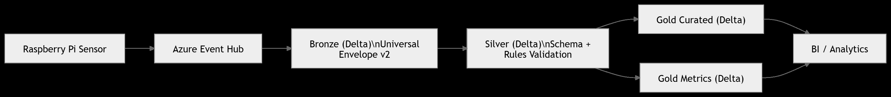
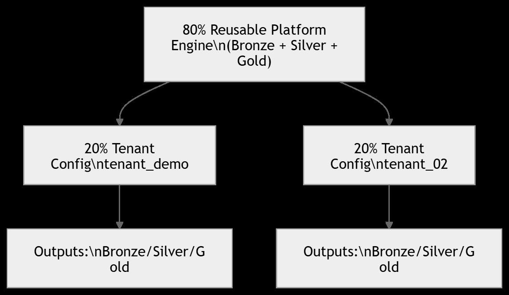
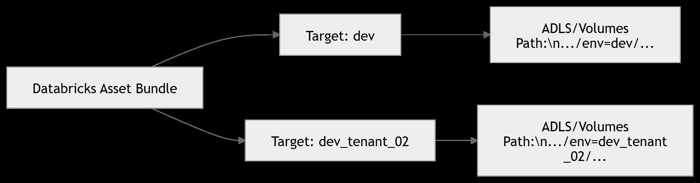
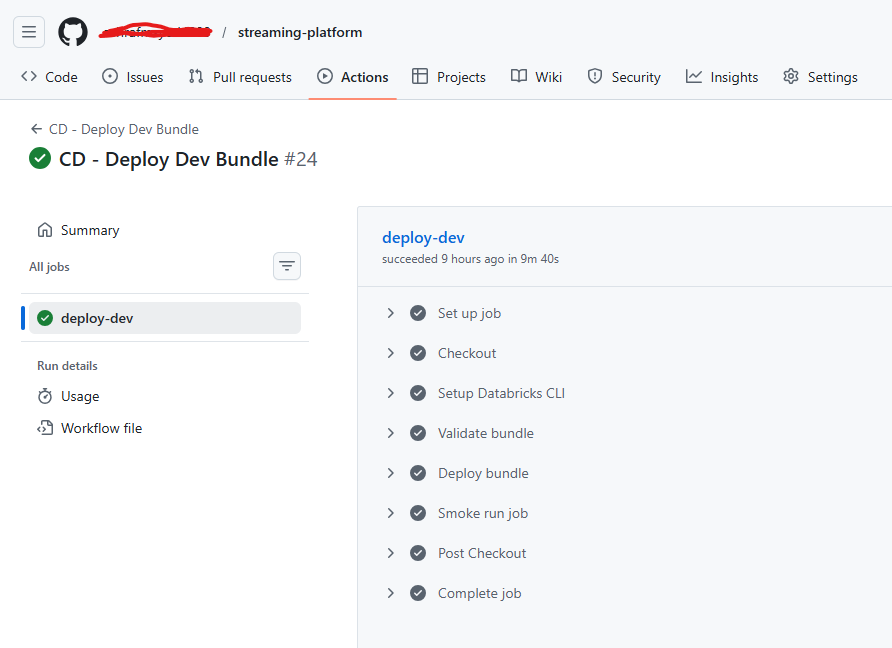
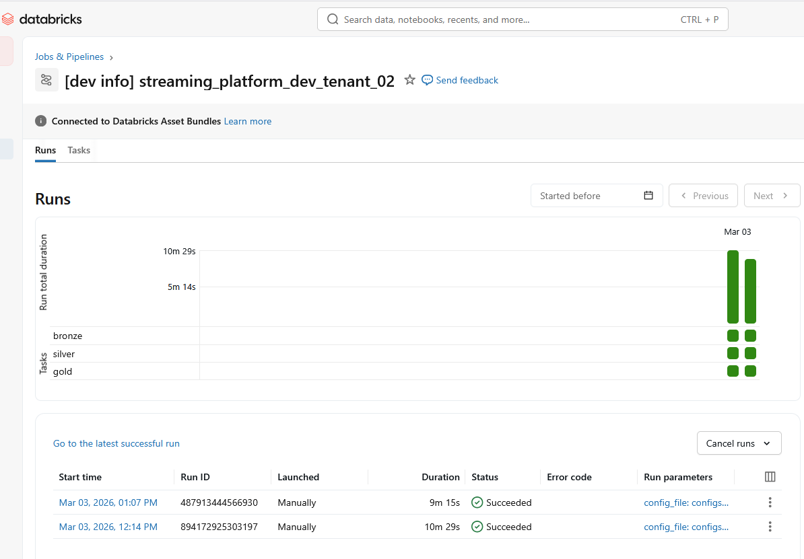
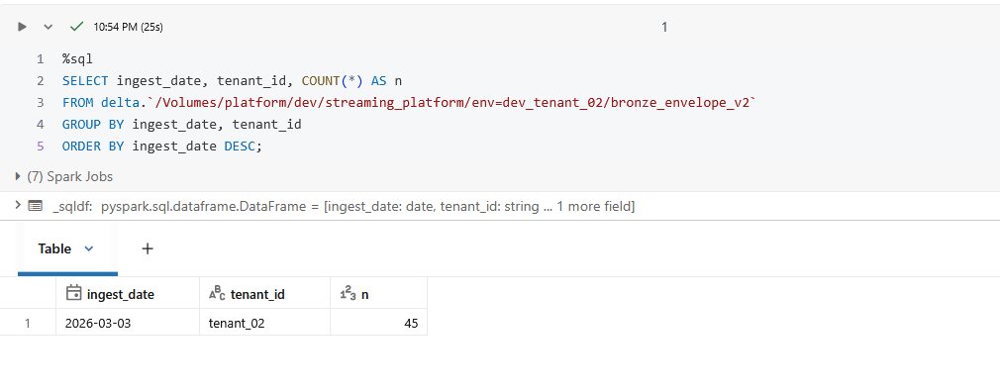
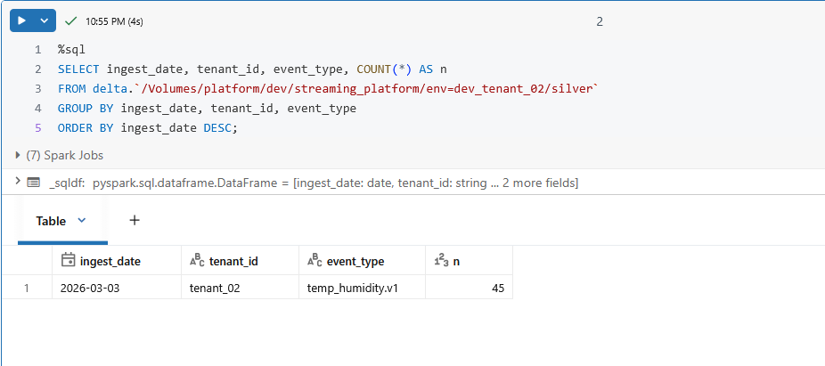
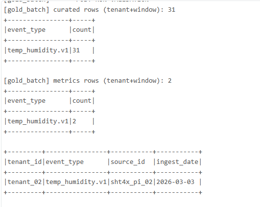

---


# 📄 Project 02 — Config-Driven Tenant Onboarding (80/20 Architecture Proof)

## Overview

Project 02 demonstrates that the **streaming data platform can onboard a new tenant without modifying the core engine code**.

The platform was designed using an **80/20 architecture**:

* **80% reusable platform engine**
* **20% configuration for new tenants**

In this project we add a **second tenant (`tenant_02`)** using the same sensor schema to prove that the platform is **config-driven and scalable**.

---

# Key Skills Demonstrated

* Streaming Data Engineering
* Azure Event Hub
* Databricks Structured Streaming
* Delta Lake Architecture
* Multi-Tenant Platform Design
* Config-Driven Pipelines
* CI/CD using Databricks Asset Bundles
* GitHub Actions Deployment

---

# Platform Architecture




```

This architecture represents a **real-time IoT streaming pipeline**:

```
Sensor → Event Hub → Bronze → Silver → Gold → Analytics


### Components

| Layer        | Description                                  |
| ------------ | -------------------------------------------- |
| Bronze       | Raw ingestion using Universal Event Envelope |
| Silver       | Schema validation + rule enforcement         |
| Gold Curated | Clean analytical dataset                     |
| Gold Metrics | Aggregated time-series metrics               |

All layers store data using **Delta Lake**.

---

# Multi-Tenant Platform Design (80/20 Architecture)



The platform separates:

### 80% Reusable Engine

Reusable platform logic:

```
src/
 ├ bronze/
 ├ silver/
 └ gold/
```

### 20% Configuration

Tenant-specific configuration:

```
configs/tenants/tenant_demo/
configs/tenants/tenant_02/
```

This design allows **new tenants to be onboarded without modifying the core pipeline logic**.

---

# Environment Isolation

<!-- INSERT ENVIRONMENT ISOLATION DIAGRAM HERE -->



Each tenant environment runs independently using **Databricks Asset Bundle targets**.

Example environments:

```
env=dev
env=dev_tenant_02
```

Storage paths:

```
/Volumes/platform/dev/streaming_platform/env=dev/
/Volumes/platform/dev/streaming_platform/env=dev_tenant_02/
```

This ensures **tenant data isolation and safe deployments**.

---

# Config-Driven Tenant Onboarding


Onboarding a new tenant requires only configuration changes.

Steps:

1. Add tenant configuration YAML
2. Add new bundle target
3. Deploy via CI/CD
4. Run existing platform job

No platform code changes are required.

---

# What Changed (20%)

New tenant configuration added:

```
configs/tenants/tenant_02/dev.yml
```

Example configuration:

```yaml
tenant:
  tenant_id: "tenant_02"
  site_id_default: "site_02"

ingestion:
  source: "eventhub"
  eventhub_name: "iot-sensor-events"
  consumer_group: "$Default"
  source_id: "sht4x_pi_02"

events:
  allowed_event_types:
    - "temp_humidity.v1"

  device_registry:
    pi-003: "temp_humidity.v1"
```

A new bundle deployment target was added:

```
dev_tenant_02
```

---

# What Did NOT Change (80%)

The **core streaming engine remained untouched**.

```
src/
 ├ bronze/
 ├ silver/
 └ gold/
```

No modifications were required to:

* ingestion logic
* validation logic
* aggregation logic

This proves the platform supports **plug-and-play tenant onboarding**.

---

# CI/CD Deployment

Deployment is performed using **GitHub Actions**.

Workflow file:

```
.github/workflows/deploy-dev.yml
```

Workflow parameters:

| Parameter   | Description                  |
| ----------- | ---------------------------- |
| target      | Deployment environment       |
| run_job     | Run job after deploy         |
| run_minutes | Streaming execution duration |

Example command executed by the workflow:

```
databricks bundle run -t dev_tenant_02 --var run_minutes=1 streaming_platform_job
```

---

# Execution Results

## Bronze Layer

Query:

```sql
SELECT ingest_date, tenant_id, COUNT(*) AS n
FROM delta.`/Volumes/platform/dev/streaming_platform/env=dev_tenant_02/bronze_envelope_v2`
GROUP BY ingest_date, tenant_id
ORDER BY ingest_date DESC;
```

Result:

| ingest_date | tenant_id | rows |
| ----------- | --------- | ---- |
| 2026-03-03  | tenant_02 | 45   |

---

## Silver Layer

Query:

```sql
SELECT ingest_date, tenant_id, event_type, COUNT(*) AS n
FROM delta.`/Volumes/platform/dev/streaming_platform/env=dev_tenant_02/silver`
GROUP BY ingest_date, tenant_id, event_type
ORDER BY ingest_date DESC;
```

Result:

| tenant_id | event_type       | rows |
| --------- | ---------------- | ---- |
| tenant_02 | temp_humidity.v1 | 45   |

---

## Gold Layer

Gold processing generated:

```
curated rows: 31
metrics rows: 2
```

Validation output:

```
tenant_02
temp_humidity.v1
sht4x_pi_02
2026-03-03
```

---

# Evidence Screenshots

### GitHub CI/CD Run



### Databricks Run



### Bronze Results



### Silver Results



### Gold Validation



---

# Key Takeaways

This project demonstrates that the streaming platform is:

* **Multi-tenant**
* **Config-driven**
* **Environment isolated**
* **CI/CD deployable**
* **Schema controlled**
* **Production scalable**

Most importantly:

> New tenants can be onboarded **without modifying platform engine code**.

This validates the **80/20 streaming platform architecture**.

---

