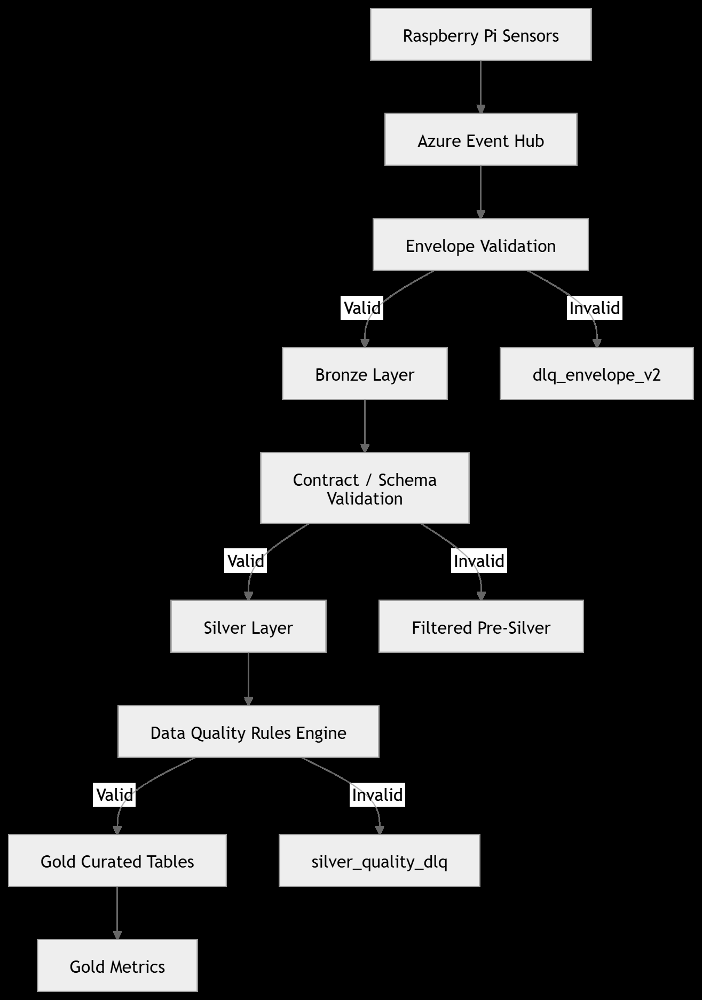
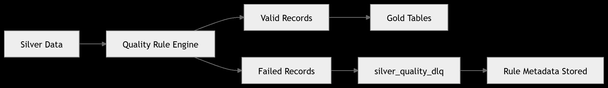
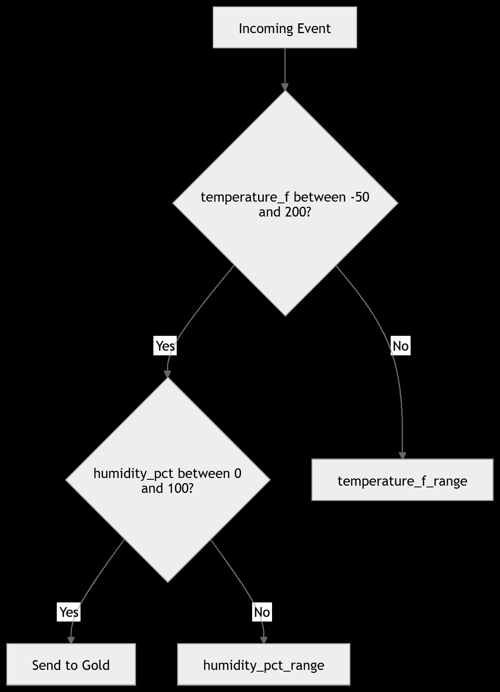

# Project 05 — Data Quality & Observability

Tag: **v1.4.0**

Project 05 introduces **data quality validation and platform observability** into the reusable streaming platform.

The objective of this project is to demonstrate how a production-grade streaming platform handles **invalid events, data quality failures, and operational monitoring** while continuing to process valid data.

The implementation remains fully aligned with the platform philosophy:

```

80% reusable platform engine
20% configuration per tenant and event type

```
## Platform Architecture

1. Overall Streaming Platform Architecture



2. Data Quality Processing (Project 05)



3. Quality Rule Evaluation Example




A[Raspberry Pi Sensors] --> B[Azure Event Hub]

B --> C[Bronze Layer<br>Universal Envelope]

C --> D[Silver Layer<br>Validation & Standardization]

D --> E[Quality Engine<br>Rule Validation]

E -->|Passed| F[Gold Curated Tables]

E -->|Failed| G[Quality DLQ]

F --> H[Gold Metrics]

E --> I[Platform Observability]


---

# 2️⃣ Data Quality Engine Diagram

Place this in the **Data Quality Engine section**.


## Data Quality Engine


flowchart TD

A[Silver Events] --> B[Rule Loader]

B --> C[Rule Engine]

C -->|Valid Records| D[Gold Processing]

C -->|Invalid Records| E[Quality DLQ]

C --> F[Observability Metrics]

---

# 3️⃣ Quality Rule Processing

## Rule Processing


flowchart TD

A[Incoming Event] --> B[Load Rules]

B --> C[Evaluate Required Fields]

C --> D[Evaluate Range Rules]

D --> E[Evaluate Timestamp Rules]

E -->|All Passed| F[Event Accepted]

E -->|Any Failed| G[Write to Quality DLQ]


---

# 4️⃣ Platform Observability Flow


## Platform Observability


flowchart TD

A[Streaming Pipeline] --> B[Quality Engine]

B --> C[Metrics Writer]

C --> D[platform_observability Table]

D --> E[Operational Monitoring]


---

# 5️⃣ End-to-End Event Flow

This one is very good for **recruiters or clients**.


## End-to-End Event Flow


flowchart LR

Sensor[IoT Sensor Event] --> EventHub[Azure Event Hub]

EventHub --> Bronze[Bronze Layer]

Bronze --> Silver[Silver Layer]

Silver --> Quality[Quality Validation]

Quality -->|Valid| GoldCurated[Gold Curated]

Quality -->|Invalid| DLQ[Quality DLQ]

GoldCurated --> Metrics[Gold Metrics]

Quality --> Observability[Platform Observability]

# Purpose

Real-world streaming systems must handle **bad data continuously**.  
Sensors, APIs, and event producers frequently generate malformed or invalid events.


Project 05 introduces a **rule-driven quality engine** that:

- validates incoming Silver events
- identifies data quality violations
- routes failed events to a **Quality DLQ**
- records **platform health metrics**

This ensures the platform remains **robust, observable, and production-ready**.

---

# Architecture

The streaming platform now includes a **data quality stage** before Gold processing.

```

Azure Event Hub
↓
Bronze (Universal Envelope + DLQ)
↓
Silver (Validation + Standardization)
↓
Quality Engine (Rule Validation)
↓
Gold Curated Tables
↓
Gold Metrics

```

Two additional system outputs are introduced:

```

Quality DLQ
Platform Observability Tables

```

---

# Data Quality Engine

The platform validates events using **rule configuration files** stored per event type.

Example rule file:

```

rules/event_types/temp_humidity.v2.yml

````

Example rules:

```yaml
- name: device_id_required
  field: device_id
  type: required

- name: temperature_f_range
  field: temperature_f
  type: between
  min: -50
  max: 200

- name: humidity_pct_range
  field: humidity_pct
  type: between
  min: 0
  max: 100

- name: event_time_utc_parseable
  field: event_time_utc
  type: timestamp
````

These rules are **configurable without changing platform code**.

---

# Supported Rule Types

The rule engine currently supports:

| Rule Type | Description                          |
| --------- | ------------------------------------ |
| required  | field must not be null               |
| between   | numeric value must be within a range |
| timestamp | value must be parseable as timestamp |
| optional  | field allowed to be null             |

Additional rule types can easily be added to the engine.

---

# Quality Processing

During processing:

1. Rules are loaded from the configuration directory.
2. Each incoming event is validated against all rules.
3. Failed rules generate **quality failure records**.
4. Failed events are written to the **Quality DLQ**.

Output tables:

```
silver_quality_dlq
platform_observability
```

---

# Quality DLQ

Invalid events are written to the **Quality Dead Letter Queue**.

The DLQ includes diagnostic metadata:

| Field            | Description                   |
| ---------------- | ----------------------------- |
| rule_name        | rule that failed              |
| rule_type        | validation type               |
| rule_field       | field evaluated               |
| failed_value     | value that caused the failure |
| quality_check_ts | validation timestamp          |
| payload_json     | original event payload        |

Example failure scenarios:

* missing device_id
* temperature outside valid range
* invalid timestamp format
* missing sensor metadata

This enables **investigation and replay of bad events**.

---

# Platform Observability

Operational metrics are written to the observability table:

```
platform_observability
```

Captured metrics include:

| Metric         | Description                       |
| -------------- | --------------------------------- |
| records_in     | total events processed            |
| records_passed | events passing quality validation |
| records_failed | events failing validation         |
| dlq_count      | number of DLQ records generated   |
| batch_ts       | batch processing timestamp        |

These metrics provide visibility into **pipeline health and event quality trends**.

---

# Implementation Components

The quality engine is implemented using reusable modules:

```
src/quality/
```

Core modules:

```
rule_loader.py
rule_engine.py
quality_runner.py
quality_writer.py
quality_dlq.py
run_quality_stage.py
```

Observability components:

```
src/observability/metrics_writer.py
```

These modules allow quality validation to be **plugged into any event type**.

---

# Example Quality Run

Example execution output:

```
records_in = 28
records_passed = 28
records_failed = 0
```

Example observability record:

| tenant_id | event_type       | layer   | records_in | records_passed | records_failed | dlq_count |
| --------- | ---------------- | ------- | ---------- | -------------- | -------------- | --------- |
| tenant_02 | temp_humidity.v2 | quality | 28         | 28             | 0              | 0         |

---

# Result

After Project 05 the platform now supports:

* rule-based data quality validation
* configurable validation rules
* Quality DLQ routing
* failure diagnostics
* platform health metrics
* observability tables
* operational monitoring

This significantly improves **platform reliability and operational visibility**.

---

# Next Steps

Future platform enhancements will include:

* schema engine
* advanced rule engine
* AI-driven event anomaly detection
* additional sensor event types
* multi-industry event processing

---

# Summary

Project 05 transforms the streaming platform into a **production-grade event processing system** by introducing:

* **data quality validation**
* **DLQ routing**
* **platform observability**

These capabilities are essential for operating reliable **real-time event pipelines at scale**.


