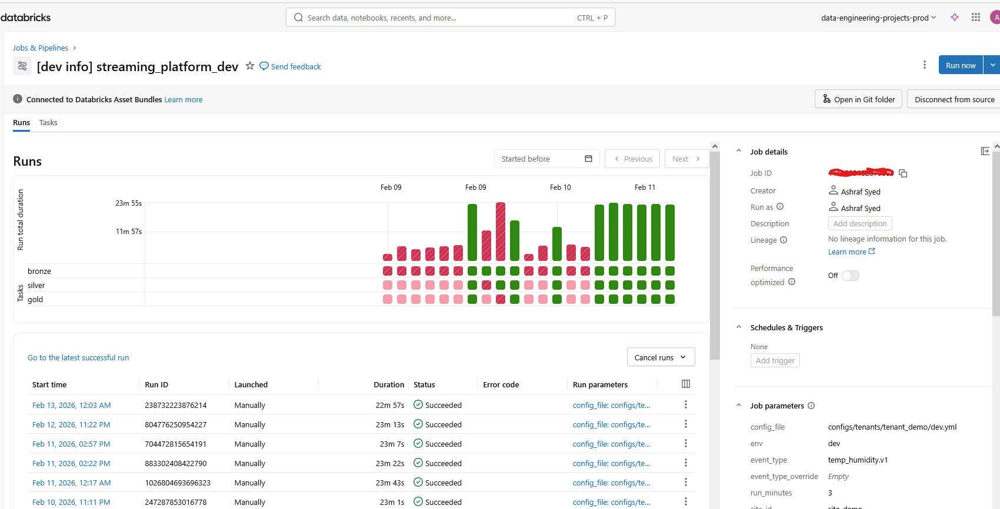
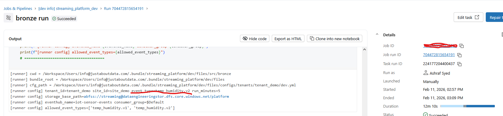
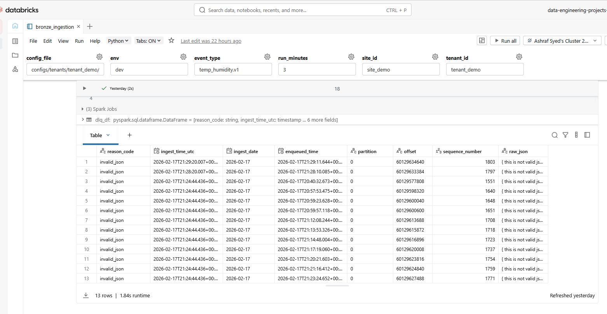
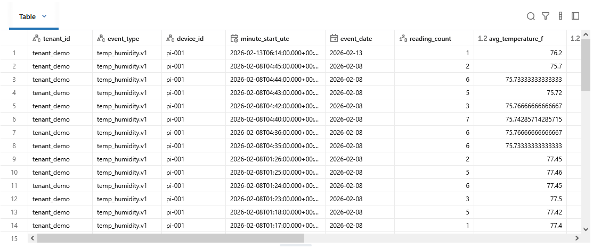

# Streaming Platform – Project 01 (Azure Production Streaming Framework)

This project implements a reusable, production-ready streaming data platform on Azure using:

- Azure Event Hubs
- Databricks Structured Streaming
- Delta Lake (Medallion Architecture)
- ADLS Gen2
- Databricks Asset Bundles (CI/CD)
- Config-driven onboarding (80/20 model)

---

## Architecture Overview

Event Hub → Bronze → Silver → Gold  
All data is stored in Delta Lake with partitioning:

```

tenant_id / event_type / ingest_date

```

The platform supports:

- Multi-tenant ingestion
- Schema validation
- Dead Letter Queue (DLQ)
- Audit metrics
- Config-driven event onboarding
- CI/CD deployment via Databricks Asset Bundles

---

## Project Highlights

### 1️⃣ Job Orchestration (Bronze → Silver → Gold)



---

### 2️⃣ Config-Driven Execution (Event Version Override)

The platform supports YAML-based configuration to onboard new event versions without modifying core logic.



---

### 3️⃣ DLQ – Corrupt Event Isolation

Invalid JSON events are detected in Bronze and routed to a Dead Letter Queue.



---

### 4️⃣ Observability – Audit Metrics

Each pipeline batch tracks:

- input_rows
- output_rows
- dlq_rows
- status
- latency metrics


---

### 5️⃣ Gold Layer (Serving Output)

Aggregated device metrics written to:

```

gold/device_minute/

```



---

## Documentation

Detailed documentation available:

- 📘 [Runbook](docs/runbook.md)
- 📘 [Onboarding – New Client](docs/onboarding_new_client.md)
- 📘 [Onboarding – New Event Type](docs/onboarding_new_event_type.md)


## How to Deploy

Validate bundle:


databricks bundle validate -t dev


Deploy:


databricks bundle deploy -t dev


Run job from Databricks Workflows UI.

---

## 80/20 Platform Model

- 80% reusable core platform logic
- 20% configuration (YAML, schema, rules)

New clients and event types require no core code changes.

---

## Status

✅ CI/CD deployment working  
✅ Config-driven event onboarding  
✅ DLQ + audit metrics validated  
✅ Managed identity secure compute  
✅ Multi-tenant partitioning  

Project 01 complete.


